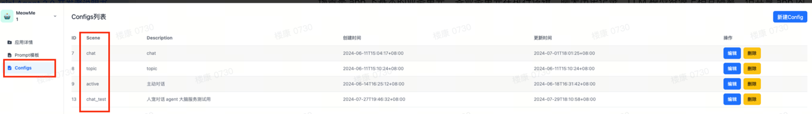
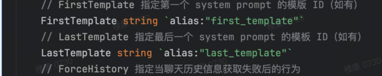

# Learn

## 目录

1. [Agent-brain 11.19笔记](#section1)
2. [开发者文档学习 11.20笔记](#section2)
3. [chat11 11.21笔记](#section3)

## Agent-brain<a id="section1"></a>
### 引擎系统
- RAG(需要维护知识库？检索增强生成。)
- Prompt管理生成
- LLM接口管理调用
- 作业编排与执行

### Social Agent 开发者说明书笔记
#### 1. Social Agent 大致了解
Social Agent是Agent中台引擎系统。主要作用:
- 管理智能体 
- 提供统一对外交互接口，这里我的理解是一方面接受Geek Api
传递过来的数据。如
  1. App名称(MeowMe,Iwee,Weparty)。
  2. 某一App下对应的场景(医学，工业等具体领域，对话，翻译等场景)。
  3. 某一场景下的对话，需要知道哪个对话(所以需要对话id)。
  4. 当前对话信息。(可以理解为对话场景，用户传过来的request，input)。

- 另外一方面也需要将经过Agent引擎处理后的结果返回给GeekApi

#### 2. 管理标识
要对Agent进行管理，那么要知道他是来自于哪个App（伊对，贴贴），来自
具体App的哪个场景(假设伊对中有单向直播，双向聊天等场景),也需要知道
是哪个用户和哪个agent在聊天，也需要对prompt模版进行管理。也需要知
道Agent对应使用的model是哪一个。


**prompt template**理解  
我对于提示词模版的作用理解如下:  
1. 明确生成方向。 比如需要当前model进行童话故事生成，那么可以利用template
进行response限制，只生成童话故事。比如需要当前model做翻译工作，那么就不提供
其他的方面。也比如风格方法，比如说严肃的老师，活泼的女孩等，可以进行人物画像。
2. 限制内容范围。 例如对色情等信息的生成管理，或者生成特定领域的知识，如医学，
就可以拥有一个知识库等获得更准确的生成。
3. 结构化框架。 通过template可以生成答复框架，如让model生成一篇新闻，可以
限定其生成{title} {abstract} {content}等标准回复框架，可以便于Api间接受，
如json格式等。

文档中给出了四个标识
1. app_id : 用来标识app

2. scene_id : 用来标识特定app下的场景scene。scene相互隔离执行逻辑，聊天历史记录，
LLM资源，(比如逻辑层面，直播和聊天的逻辑肯定不同，直播和聊天的历史记录也都
需要单独存储，vip用户和普通用户的LLM资源也不同），共享其他资源。


3. prompt_id : 用来标识App下的不同模版prompt，比如(马嘉祺，坤坤等不同人物demo)，
4. model_id : 用来标识当前使用的model，比如通用大模型有LLM资源池，比如有10个gpt4o，
所以需要有一个model_id来标识当前使用的model是哪一个。

##### 思考
- app_id : 标识app(伊对 还是 贴贴)
- scene_id : 标识scene_id(执行逻辑(不同场景执行逻辑不同，AI助睡单方面说话就行，
而AI女友对话需要交互；model_ID,不同场景用的LLM不同，LLM资源有很多，比如有10个gpt4o，
不同场景用的prompt_template不同，例如睡前故事场景需要扮演妈妈身份，恋爱场景需要扮演女友身份)

所以对于agent-brain请求时，需要知道app_id + scene_id + user_id + agent_id+ now_query + prompt_template_id + session_id。  
***这里对于session_id不是特别理解***

***这里对于firstTemplate和LastTemplate不理解***



## 开发者文档学习 <a id="section2"></a>


#### internal/components 学习

##### 文件格式
`components`
  - `exampleFolder`
    - `base.go`
    - `exampleFile.go`

##### 步骤
1. 在`init.go`中注册，即`exampleFolder`文件夹的路径。
`_ "gitlab.miliantech.com/geeks/agent-brain/internal/components/ExampleFolder"`
2. 在`base.go`中写组件接口，`exampleFile.go`中需要实现这一组件接口。
```golang
type EncryptComponent interface {
	//@registry.Component : i/o型(远程服务，grpc)->true; 计算密集型()->false;
	registry.Component
	Encrypt(ctx context.Context, s string) string
}
```
`registry.Component`也是一个接口，需要实现`Remote() bool`方法
所以在`exampleFile.go`中实现组件接口时，需要实现上述两个方法。
3. 在`exampleFile.go`的`init()`中,需要进行组件初始化登记，如下
```golang
func init() {

	//范型， 支持多种数据格式
	registry.RegisterComponent[*ExampleEncrypt, EncryptComponent](
        //命名
		"ExampleEncrypt",
		//匿名函数
		func(param *ExampleEncrypt) EncryptComponent {
			return param
		},
	)
}
```

#### 场景组件
要将yaml文件转化为agent内部可执行的对象
1. agent执行通用能力，聊天历史存取，大模型调用(history_config, llm_config)
2. 执行器配置（用来场景实现逻辑)
`@type : string`   : 执行器名称 
`@params : map[string]any `
通用组件yaml格式:  
type , params  
yaml :
  
history_config : 
llm_config : 


# chat11(单聊) <a id="section3"></a>


## chat11(单聊)_server
理解:接收客户端的数据


### grpc相关

**1. rpc服务定义**:
```proto
service AgentBrainService {
  rpc Chat11 (AgentBrain11Req) returns (AgentBrainResp) {}
}
```

**2. rpc服务请求消息定义**:  
`AgentBrain11Req`:
- `app_id`     : (标识不同app，伊对，贴贴)；
- `scene_id`   : (标识不同场景，不同场景执行逻辑不同，LLM需求资源不同...)；
- `user_id`    : (标识不同用户)；
- `agent_id`   : (标识不同agent)；
- `session_id` : (标识独立记忆)；
- `query`      : 用户输入；
- `prompt_input_json` : prompt模版；
- ...

**3. rpc服务响应消息定义**
- `response` : 答复；
- `detial`: 本次对话输入，输出，总token数；
- `status` : 此次响应状态；


**4. 生成的？_grpc.pb.go理解**  
用来定义客户端和服务端之间的grpc通信相关，

图中`AgentBrainServiceServer`接口定义的方法
`Chat11(context.Context, *AgentBrain11Req) (*AgentBrainResp, error)`
可以看到比之前在`rpc Chat11 (AgentBrain11Req) returns (AgentBrainResp) {}`
中多了`context.Context` 和 `error`，我的理解，context.Context在这里类似于http
的相应头。

### main()函数理解

**1. `agentBrainServer`结构体**

第一行`rpc.UnimplementedAgentBrainServiceServer`相当于定义了一个rpc服务

newAgentBrainServer(新建AgentBrain服务器)步骤
1. 从envs.EnvAgentBrainPreloadEng中读取app_id 和 scene_id.
   - 这里有个问题，这个环境变量读取是怎么样的？


1. sLockShards := 8  
2. newAgentBrainServer(sLockShards)  
3. agentBrainServer结构体理解：
   1. rpc.UnimplementedAgentBrainServiceServer ： 
        - 定义rpc通信服务相关
        - 结构体有一个绑定方法 Chat11(context.Context, *AgentBrain11Req) (*AgentBrainResp, error)
            - 相比于在proto文件中定义的服务：rpc Chat11 (AgentBrain11Req) returns (AgentBrainResp)，
              可以看到多了两个参数，一个是context.Context，我对这个的理解就是http的请求头，封装metadata；
              一个是error。
   2. engines sync.Map : 
        - 引擎存储
   3. lock : syncutil.IShardsLock[string]
        - 通过sLockShards初始化，**这里就大致了解了一下，是一种运用了分片概念的分布式锁定机制。**
4. 通过envs.EnvAgentBrainPreloadEng.Val()读取app_id 和 scene_id。
5. 引擎获取:_, err = s.getEng(uctx.Get(), uint32(appID), sceneID)
    - uctx.Get()理解  
    ```
    package uctx
    import "context"
    var ctx context.Context
    func init() {
        ctx = context.Background()
    }
   func Get() context.Context {
        return ctx
    }
   ```
    执行该函数时，会先执行init()下的context.Background(),初始化一个context，然后返回。
6. getEng()
    ```golang
   func (s *agentBrainServer) getEng(
   ctx context.Context, appID uint32, sceneID string) (engine.AgentEngine, error) {
   k := engK{appID: appID, sceneID: sceneID}
   if e, ok := s.engines.Load(k); ok {
       return e.(engine.AgentEngine), nil
   }
   return s.buildEng(ctx, k, false)
   }
    ```
- 输入参数:context.Context用于上下文传递，appID和sceneID用来初始化engK{}。 
engk{}为key查询map:engines,如果查到就返回引擎e.(engine.AgentEngine)，如果查不到就buildEng。
- 输出参数:一个AgentEngine。
7. AgentEngine 理解
   - 接口，定义了很多功能
     1. `WithContext(
        ctx context.Context, runtime *agentctx.RuntimeContext) context.Context
        **理解**：相当于往ctx加入(AgentContext)即runtimeContext中的k-v对和metaContext的k-v信息，meta里有AppID和SceneID。
        
     2. ...
8. buildEng()  
   查不到，新建一个Eng，通过ctx,AppID和SceneID。engine.New()
   1. confcenter.GetAppCenter(ctx, appID) 
    


## chat11(单聊)_client
**理解**
- `client`初始化`env`(`dev`|`qa`),`addr`(rpc服务器位置，`env`=`dev`则在localhost的端口)，
以及下面rpc客户端请求结构体内的信息，通过在proto中定义的rpc服务`chat11`向服务器请求并接收答复。

**rpc服务定义**
```proto
service AgentBrainService {
  rpc Chat11 (AgentBrain11Req) returns (AgentBrainResp) {}
}   
```

**rpc客户端请求结构体`AgentBrainResp`**
如下:
- `AppId` :
- `SceneId` :
- `UserId` : 
- `AgentId` : 
- `Query` : 用户输入查询
- `PromptInputJson` : 提示词输入模版
- ......


